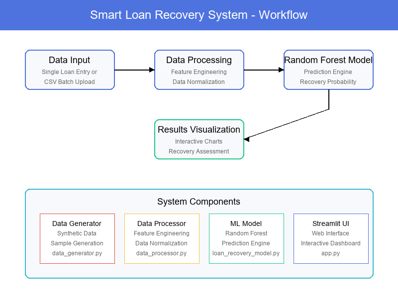

# Smart Loan Recovery System

A machine learning-powered system for predicting loan recovery probability with a Streamlit web interface.

## Overview

The Smart Loan Recovery System helps financial institutions predict the likelihood of recovering loans by analyzing various customer and loan attributes. The system uses machine learning algorithms to provide insights that can help prioritize collection efforts and optimize recovery strategies.

## System Workflow



The diagram above illustrates the complete workflow of the Smart Loan Recovery System:

1. **Data Input**: Users can enter individual loan details or upload CSV files for batch processing
2. **Data Processing**: The system preprocesses the data, performs feature engineering and normalization
3. **Random Forest Model**: The prediction engine analyzes the data using the Random Forest algorithm
4. **Results Visualization**: Interactive charts display recovery probability and risk assessment

The bottom section shows the key system components and their relationships, providing a clear overview of the system architecture.

## Features

- **Predictive Analytics**: Uses machine learning to predict loan recovery probability
- **Individual Loan Assessment**: Analyze individual loans for recovery potential
- **Batch Processing**: Process multiple loans at once for efficient analysis
- **Data Visualization**: Interactive charts and graphs for better understanding
- **Risk Factor Identification**: Highlights key factors affecting recovery

## Installation

1. Clone the repository:
```
git clone https://github.com/yourusername/smart-loan-recovery-system.git
cd smart-loan-recovery-system
```

2. Create a virtual environment and install dependencies:
```
python -m venv venv
source venv/Scripts/activate  # On Windows
# OR
source venv/bin/activate  # On macOS/Linux
pip install -r requirements.txt
```

## Usage

1. Generate sample data and train the Random Forest model:
```
python src/train_model.py
```

2. Run the Streamlit application:
```
streamlit run app.py
```

3. Open your browser and navigate to `http://localhost:8501`

## Project Structure

```
smart-loan-recovery-system/
├── app.py                  # Main Streamlit application
├── data/                   # Data directory
│   └── loan_data.csv       # Sample loan data
├── models/                 # Trained models
├── src/                    # Source code
│   ├── models/             # ML model implementations
│   │   └── loan_recovery_model.py
│   ├── preprocessing/      # Data preprocessing
│   │   └── data_processor.py
│   ├── utils/              # Utility functions
│   │   └── data_generator.py
│   └── train_model.py      # Script to train models
├── README.md               # Project documentation
└── requirements.txt        # Project dependencies
```

## Machine Learning Model

The system uses a Random Forest model for loan recovery prediction:

**Random Forest**: An ensemble learning method that operates by constructing multiple decision trees. It provides high accuracy and can handle non-linear relationships in the data, making it ideal for loan recovery prediction.

## Web Interface

The Streamlit web interface focuses solely on loan recovery prediction, providing a clean and intuitive interface for users to predict the probability of recovering loans.

### Sample Interface


### Sample Results


The interface allows users to:
- Enter individual loan details with comprehensive input fields
- Upload CSV files for batch processing
- View recovery probability with visual indicators
- Receive recovery assessment and risk factor identification

> Note: The screenshots above show sample results from the application. You'll need to add your own screenshots to the `screenshots` directory after running the application.

## License

This project is licensed under the MIT License - see the LICENSE file for details.

## Contact

For more information, please contact nikhilmahesh89@gmail.com.com
